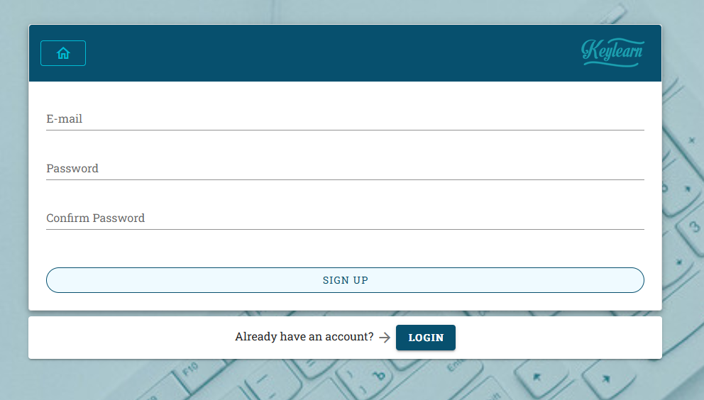
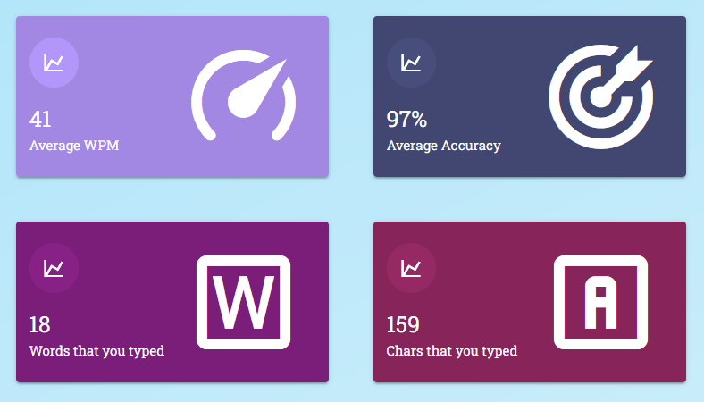
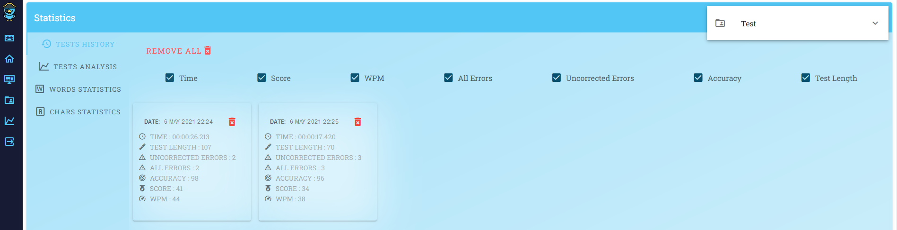
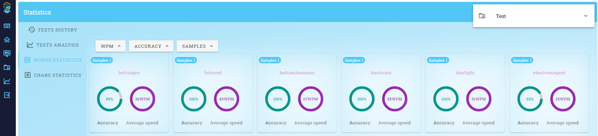
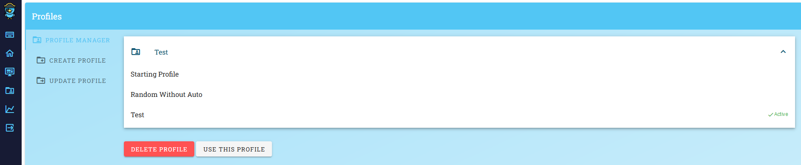
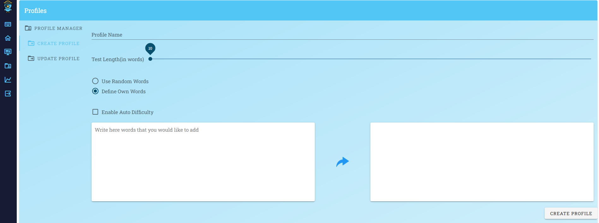

# Keylearn - _increase your typing speed_
---
Keylearn is an web app designed to help you learn quick typing and to collect information about your progress towards achieving this goal.

__Testing Credentials: `test@test.com` / `test123`__

[__=> LINK TO LIVE VERSION <=__](toDo)
---
## Table of Contents
* [General Informations](#general-informations)
* [Technologies](#technologies)
* [Features](#features)
* [Usage](#usage)
* [License](#license)
---
## General Informations
Training with Keylearn consists of rewriting the displayed text as quickly as possible. Displayed text can be generated randomly from the base of english words or can be provided by the user. Each complated test is analyzed and obtained results are saved to the database.

---

## Features

- Account registration and login
- Creating, editing and removing profiles
- Collecting and displaying tests results
- Displaying statistics about complated tests and typed words and letters
- Auto difficulty adjustment for user provided texts based on results

---
## Technologies
List of technologies used to build the app:
__Database__
- [mysql] - open-source relational database management system.

__Backend:__
- [laravel] - php web application framework.

__Frontend:__
- [vue] - progressive JavaScript Framework.
- [vuetify] - Open Source UI Library with beautifully handcrafted Vue Components.
- [vue-chartjs] -  wrapper for Chart.js in Vue.
- [vue-keypress] - global keypress event handler component for Vue.js 2 applications.
- [vue-router] - expressive, configurable and convenient routing for Vue.js.
- [vuex] -  state management pattern + library for Vue.js applications. 
- [vue-axios] - small wrapper for integrating axios to Vue.
- [howler.js] - audio library for the modern web.

---
## Usage

### Practice Typing

App generates text to type. User by pressing ENTER on keyboard can start the test. Time starts when user starts typing.

### Registration and login

To save practice results and statistics user needs to create account and login.

### Dashboard

When logged use have access to dashboard. Where he can see collected results and statistics.

- ##### General Statistics

- ##### Tests History

- ##### Words Statistics

### Managing Profiles

User can create, update, remove profiles. Each profile can have different settings and collected data is separated for each profile. Currently used profile can be changed in any moment.

While creating profile user specifies test length and can choose if words should be generated randomly or if app should use words provided by user.

---
## License

MIT

[mysql]: <https://www.mysql.com>
[laravel]: <https://laravel.com>
[vue]: <https://vuejs.org>
[vuetify]: <https://vuetifyjs.com>
[vue-chartjs]: <https://vue-chartjs.org>
[vue-keypress]: <https://www.npmjs.com/package/vue-keypress>
[vue-router]: <https://router.vuejs.org>
[vuex]: <https://vuex.vuejs.org>
[vue-axios]: <https://www.npmjs.com/package/vue-axios>
[howler.js]: <https://howlerjs.com>
