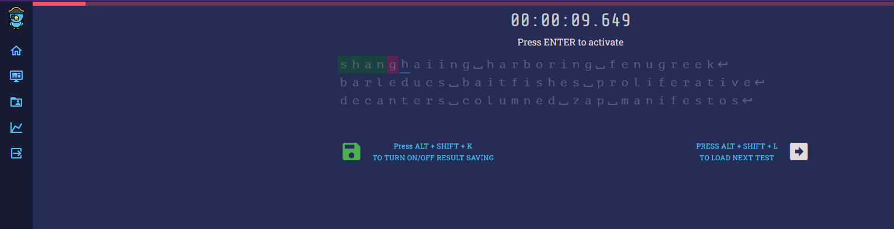

# Keylearn _- increase your typing speed_

Keylearn is an web app designed to help you learn quick typing and to collect information about your progress towards
achieving this goal.

## [🔗 CLICK TO SEE IT LIVE](https://keylearn.rafaljagielski.pl)

## Table of Contents

[⚓General Informations](#general-informations)

[⚓Technologies](#technologies)

[⚓Features](#features)

[⚓Usage](#usage)

[⚓License](#license)

## General Informations

Training with Keylearn consists of rewriting the displayed text as quickly as possible. Displayed text can be generated
randomly from the base of english words or can be provided by the user. Each complated test is analyzed and then
obtained results are saved to the database.

## Features

- Account registration and login
- Creating, editing and removing profiles
- Collecting and displaying tests results
- Displaying statistics about complated tests and typed words and letters
- Auto difficulty adjustment for user provided texts based on results

## Technologies

List of technologies used to build the app:

**Database:**

<a href="https://www.mysql.com">
Mysql</a> - open-source relational database management system.

**Backend:**

<a href="https://laravel.com">
Laravel</a> - web application framework with expressive, elegant syntax.

**Frontend:**

<a href="https://vuejs.org">
Vue</a> - an approachable, performant and versatile framework for building web user interfaces.

<a href="https://vuex.vuejs.org">
Vuex</a> - state management pattern + library for Vue.js applications.

<a href="https://router.vuejs.org">
Vue-router</a> - expressive, configurable and convenient routing for Vue.js.

<a href="https://vuetifyjs.com">
Vuetify</a> - open source UI library with beautifully handcrafted Vue Components.

<a href="https://www.npmjs.com/package/vue-keypress">
Vue-keypress</a> - global keypress event handler component for Vue.js 2 applications.

<a href="https://vue-chartjs.org">
 Vue-chartjs</a> - wrapper for Chart.js in Vue.

<a href="https://axios-http.com">
 Axios</a> - promise-based HTTP Client for node.js and the browser.

<a href="https://howlerjs.com">
 Howlerjs</a> - audio library for the modern web.

## Usage

### Practice Typing

App generates text to type. User by pressing ENTER on the keyboard can start the test. Time starts when user starts
typing.

### Registration and login

To save practice results and statistics user has to create account and login.

### Dashboard

When logged user has access to dashboard, where he can see collected results and statistics.

##### General Statistics

##### Tests History

##### Words Statistics

### Managing Profiles

User can create, update, remove profiles. Each profile can have different settings.Collected data is separated for each
profile. Currently used profile can be changed in any moment.

While creating profile user can set the test length and can choose if words should be generated randomly or if app
should use words provided by user.

## License

MIT

[mysql]: https://www.mysql.com
[laravel]: https://laravel.com
[vue]: https://vuejs.org
[vuetify]: https://vuetifyjs.com
[vue-chartjs]: https://vue-chartjs.org
[vue-keypress]: https://www.npmjs.com/package/vue-keypress
[vue-router]: https://router.vuejs.org
[vuex]: https://vuex.vuejs.org
[vue-axios]: https://www.npmjs.com/package/vue-axios
[howler.js]: https://howlerjs.com
